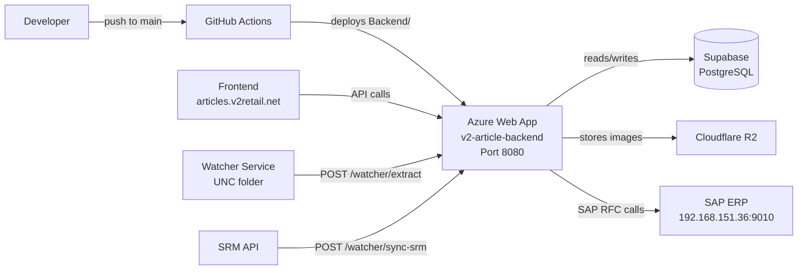

# System Overview

#architecture #stack #deployment

← [[00 - Index]]

---

## Tech Stack

| Layer | Technology |
|-------|-----------|
| **Frontend** | React 19 + TypeScript, Vite, Ant Design 5, TanStack Query, React Router 7 |
| **Backend** | Node.js / Express + TypeScript, Prisma ORM |
| **Database** | PostgreSQL via Supabase (2 schemas: `public`, `360article`) |
| **AI Models** | Anthropic Claude 3.5 Sonnet, OpenAI GPT-4o, HuggingFace FashionCLIP, Ollama |
| **Storage** | Cloudflare R2 (S3-compatible) — images, approved exports |
| **Deployment** | Backend → Azure Web App `v2-article-backend` (Node 22, P2v3) |
| **Frontend Host** | Vercel / static → `articles.v2retail.net` |
| **CI/CD** | GitHub Actions — triggers on push to `main` for `Backend/**` changes |
| **Monitoring** | Sentry |
| **Cache** | Redis Cloud (dev) / disabled in Azure prod (`ENABLE_REDIS=false`) |
| **Queue** | In-memory queue (max 4 concurrent extractions, 40k TPM limit) |

---

## Repo Structure

```
article creation/
├── Frontend/                    # React/Vite app
│   └── src/
│       ├── features/            # Feature modules (approver, extraction, admin…)
│       ├── data/                # Static JSON/TS — MC codes, mandatory fields
│       ├── services/            # API call helpers
│       └── shared/              # Utils, types, shared components
│
├── Backend/                     # Express API
│   └── src/
│       ├── controllers/         # Request handlers
│       ├── services/            # Business logic
│       ├── routes/              # Route registration
│       ├── middleware/          # Auth, rate limiting
│       ├── utils/               # Helpers (article description, MC code, segment)
│       ├── data/                # JSON data files (HSN, segments, BOM grids)
│       └── generated/prisma/    # Prisma client
│
├── watcher/                     # File watcher service (auto-ingests UNC path images)
├── .github/workflows/           # CI: ci-check.yml, deploy-backend.yml
└── docs/                        # This Obsidian vault
```

---

## Deployment Architecture



---

## Branches

| Branch | Purpose |
|--------|---------|
| `main` | Production — Azure deploys from here |
| `develop` | Active development — always ahead of main |

> As of 2026-05-02: develop was merged to main. See [[13 - Pending Issues]] for what's still outstanding.

---

## Environment Variables (key ones)

```
PORT=5001 (dev) / 8080 (Azure)
DATABASE_URL / DIRECT_URL     — Supabase PostgreSQL
JWT_SECRET                    — auth token signing
OPENAI_API_KEY / ANTHROPIC_API_KEY / GOOGLE_API_KEY
WATCHER_API_KEY=watcher-fashion-2026
ENABLE_REDIS=false            — Redis disabled in prod
SRM_API_URL / SRM_API_KEY     — SRM integration
ZMM_RFC_URL                   — SAP ZMM_ART_CREATION_RFC endpoint
ZMM_VAR_RFC_URL               — SAP ZMM_VAR_ART_CREATION_RFC endpoint
```
