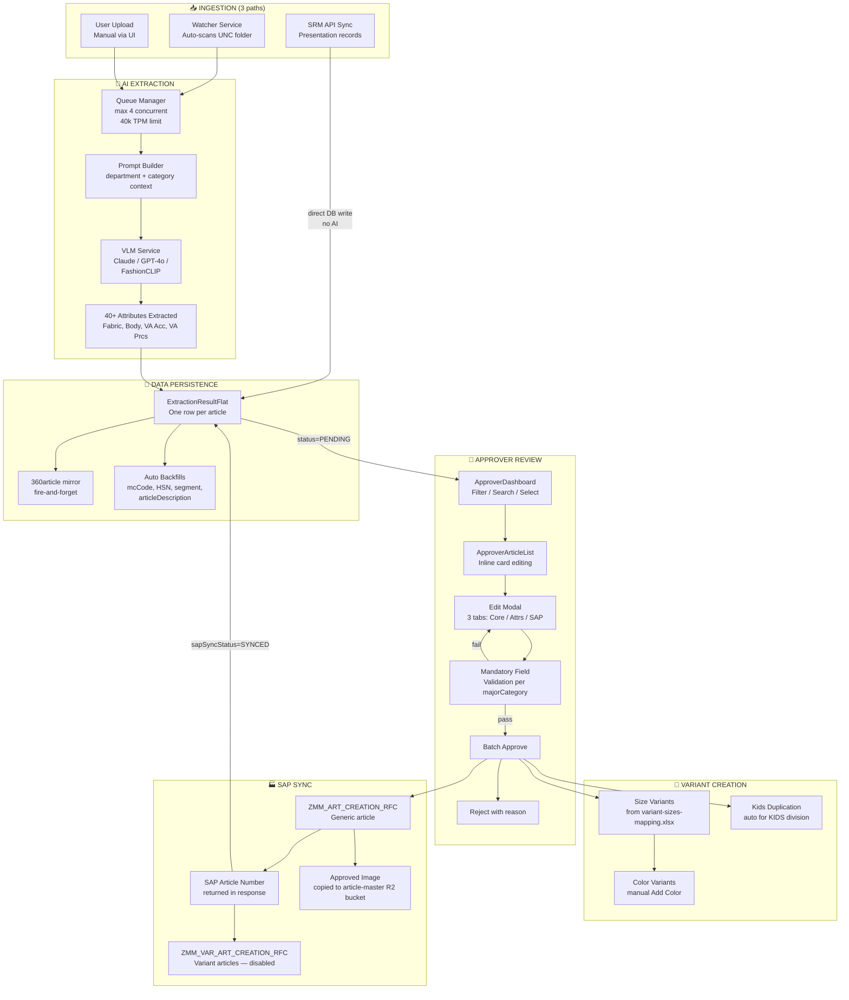
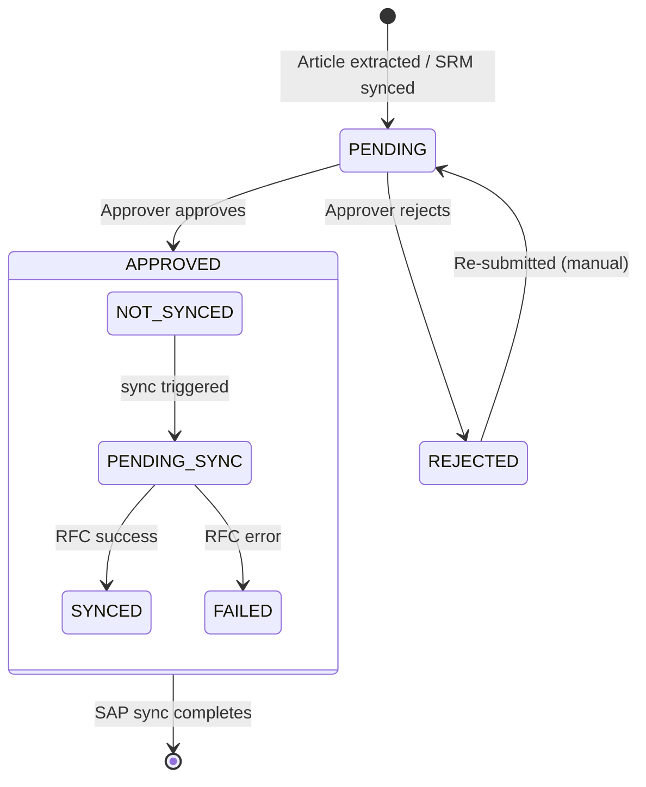

# Full End-to-End Workflow

#workflow #process #overview

← [[00 - Index]]

---

## Complete Journey: Image → Live SAP Article

---

## Stage-by-Stage Detail

### Stage 1 — Image Ingestion

Three ways images enter the system:

| Path | Trigger | AI Run? | Key field set |
|------|---------|---------|--------------|
| **Watcher** | File appears in UNC share | Yes | `imageUncPath` |
| **User Upload** | Manual drag-drop in UI | Yes | `imageUrl` (R2) |
| **SRM Sync** | Cron / manual trigger | **No** | `pptNumber`, `imageUrl` |

> See [[03 - Image Ingestion]] for detail.

---

### Stage 2 — AI Extraction

- Queue accepts job → VLMService picks provider (Claude primary, GPT-4o fallback)
- Prompt includes: department, division, major category context
- Output: JSON of 40+ attributes with confidence scores
- Results matched against `AttributeAllowedValue` master list (tokenization matching)

> See [[04 - AI Extraction Pipeline]] for detail.

---

### Stage 3 — Flattening & Persistence

- One `ExtractionResultFlat` row created per image/article
- Auto-derives: `mcCode`, `hsnTaxCode`, `segment`, `articleDescription`, `season`
- Mirrors to `360article.article_360_flat` (analytics) — fire-and-forget, never blocks
- Startup backfills run at every backend start to repair missing derived fields

---

### Stage 4 — Approver Review

- Approvers see `status=PENDING` articles scoped to their division
- They can inline-edit dropdowns on the card (all 4 attribute groups)
- Full edit modal has 3 tabs: Core fields / Attributes / Business & SAP
- Mandatory fields checked per majorCategory from Excel grid (`maj-cat-mandatory.json`)
- Always mandatory: `mrp` (non-zero), `impAtrbt2`; `referenceArticleDescription` optional

> See [[05 - Approver Flow]] for detail.

---

### Stage 5 — Approval & SAP Sync

1. Approver selects items → clicks Approve
2. Each item validated again server-side
3. `approvalStatus = APPROVED`, `approvedBy`, `approvedAt` set
4. `syncApprovedItemsToSap()` called:
   - `ZMM_ART_CREATION_RFC` → returns SAP article number
   - `sapArticleId` written back, `sapSyncStatus = SYNCED`
5. Approved image copied from source to `article-master` R2 bucket

> See [[06 - SAP Sync & RFC]] for detail.

---

### Stage 6 — Variant Creation

- After generic article approved → size variants auto-created (per Excel mapping)
- Optional: approver adds color variants via "Add Color" button
- KIDS division: auto-duplicates article to sibling categories (e.g., KGU → all kids sub-cats)

> See [[07 - Variant & Kids Logic]] for detail.

---

## Status State Machine

---

## Role Access by Stage

| Stage | CREATOR/USER | APPROVER | CATEGORY_HEAD | ADMIN |
|-------|-------------|----------|---------------|-------|
| Upload images | ✅ | ❌ | ❌ | ✅ |
| View extraction | ✅ | ❌ | ❌ | ✅ |
| Approver dashboard | ❌ | ✅ (scoped div+subdiv) | ✅ (scoped div) | ✅ (all) |
| Approve / Reject | ❌ | ✅ | ✅ | ✅ |
| Admin panel | ❌ | ❌ | ❌ | ✅ |
| Export Excel | ❌ | ✅ | ✅ | ✅ |
