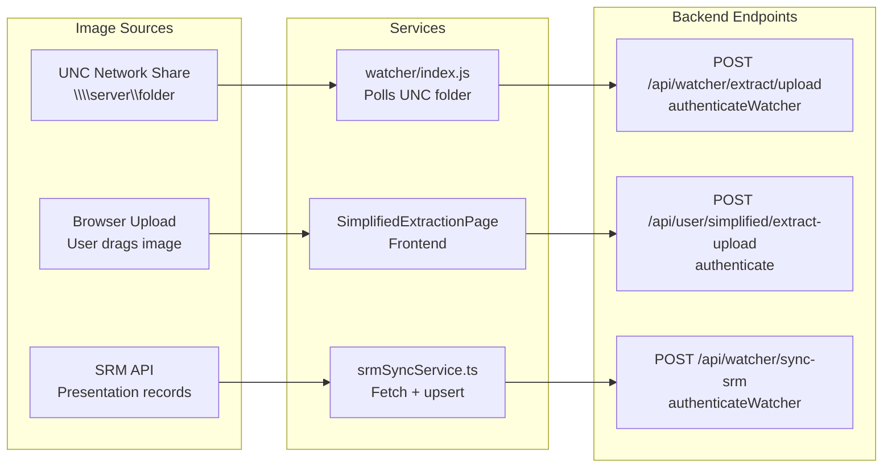
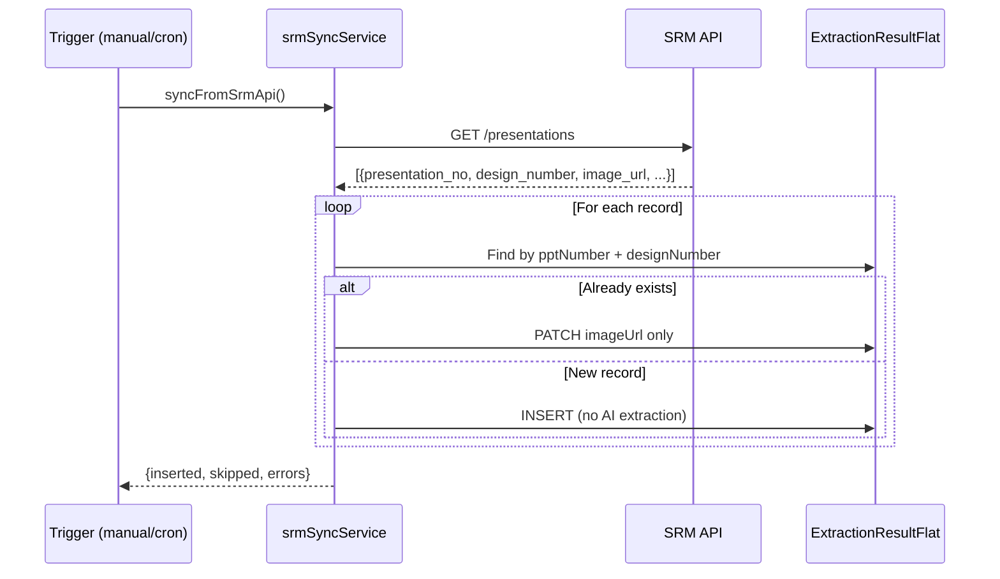

# Image Ingestion — All Entry Points

#ingestion #watcher #srm #upload

← [[00 - Index]] | [[02 - Full Workflow]]

---

## Three Entry Paths



---

## Path 1 — Watcher Service

**File**: `watcher/index.js`  
**How it works**:
- Polls a configured UNC folder path on a schedule
- Detects new image files (JPEG/PNG)
- POSTs each image as multipart/form-data to `/api/watcher/extract/upload`
- Auth: `X-API-Key: watcher-fashion-2026`

**Metadata sent with image**:
```
watcher_division        — e.g. "MENS"
watcher_vendor_code     — vendor identifier
watcher_major_category  — e.g. "COTTON SHIRTS"
watcher_sub_division    — e.g. "TOPWEAR"
image_unc_path          — full UNC path (unique identifier for dedup)
```

**Dedup**: `imageUncPath` is unique in DB — if same path re-submitted, it's skipped/updated, not duplicated.

**Processing**: Routed to `EnhancedExtractionController.extractFromUploadVLM` → full AI pipeline

---

## Path 2 — User Upload (Frontend)

**Page**: `Frontend/src/features/extraction/pages/SimplifiedExtractionPage.tsx`  
**Endpoint**: `POST /api/user/simplified/extract-upload`  
**Auth**: JWT Bearer token (authenticated user)

**How it works**:
- User drags/drops or selects image file (max 15MB, JPEG/PNG/WebP)
- Frontend converts to FormData
- Backend: multer disk storage → base64 → VLM pipeline
- Uses simplified 27-attribute schema (vs full 40+ for watcher)

**Metadata provided by user**:
- Division, Sub Division, Major Category, Vendor Name, Design Number

---

## Path 3 — SRM API Sync

**File**: `Backend/src/services/srmSyncService.ts`  
**Endpoint**: `POST /api/watcher/sync-srm`  
**Auth**: Watcher API key

**How it works**:


**Key rules for SRM records**:
- `pptNumber` set to `presentation_no` — **never overwritten by AI extraction**
- `imageUrl` set to SRM-provided URL
- `isGeneric = true` (no size variants auto-created)
- `kidsDivisionDuplication` skipped
- AI extraction skipped entirely — just raw data from SRM

**Fields populated by SRM** (others remain null for approver to fill):
```
pptNumber, imageUrl, designNumber, division, subDivision, majorCategory, vendorCode
```

---

## Path Comparison

| Property | Watcher | User Upload | SRM Sync |
|----------|---------|-------------|----------|
| AI Extraction | ✅ Full VLM | ✅ Simplified | ❌ None |
| Size variants auto-created | ✅ | ✅ | ❌ |
| Kids duplication | ✅ | ✅ | ❌ |
| PPT Number set | ❌ Never | ❌ Never | ✅ Always |
| Trigger | Automated (folder poll) | Manual (user) | Manual/cron |
| Auth | API Key | JWT | API Key |
| Dedup key | `imageUncPath` | None | `pptNumber + designNumber` |
