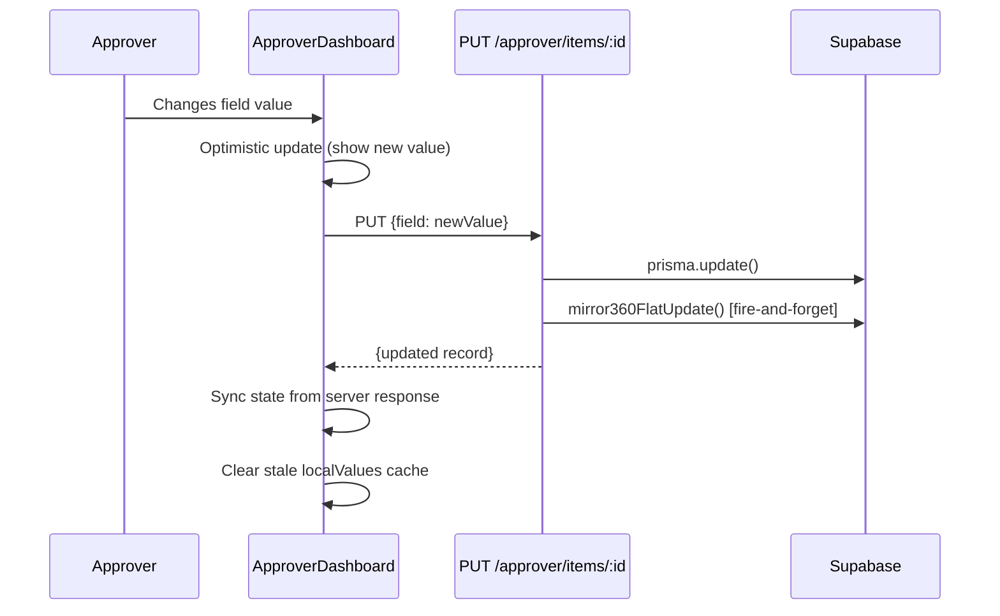
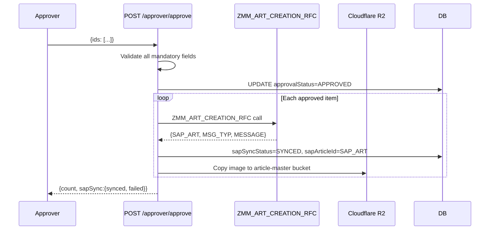

# Approver Flow

#approver #workflow #validation #dashboard

← [[00 - Index]] | [[02 - Full Workflow]]

---

## Approver Dashboard — Full UI Flow

```mermaid
flowchart TD
    LOGIN[Approver logs in] --> DASH[ApproverDashboard\n/approver]
    DASH --> TABS{Path tabs}
    TABS --> NEW[New Articles\npathType=new]
    TABS --> OLD[Old Articles\npathType=old\n10-digit numeric names]
    TABS --> REJ[Rejected\npathType=rejected]

    NEW --> FILTER[Apply Filters\ndivision / subDivision / majorCat\nstatus / date range / search]
    FILTER --> LIST{View mode}
    LIST --> CARDS[Card Grid View\nApproverArticleList]
    LIST --> TABLE[Table View\nApproverTable]

    CARDS --> INLINE[Inline edit dropdowns\nFAB / BODY / VA ACC / VA PRCS]
    CARDS --> VARIANTS[Expand → Variant SubTable\nsize × color matrix]

    CARDS --> EDITBTN[Edit button → Modal]
    EDITBTN --> TAB1[Tab 1: Core Fields\narticleNumber, division, mrp, rate,\nvendorName, designNumber, pptNumber]
    EDITBTN --> TAB2[Tab 2: Attributes\nAll mandatory fields per majCat]
    EDITBTN --> TAB3[Tab 3: Business & SAP\nmcCode, hsnCode, segment,\nimpAtrbt2, articleDescription]

    INLINE & TAB1 & TAB2 & TAB3 --> SAVE[PUT /approver/items/:id\nAuto-derive: mcCode, HSN, description]

    CARDS --> SELECT[Select articles checkbox]
    SELECT --> BATCHAPPROVE[Batch Approve button]
    BATCHAPPROVE --> MANVALID[Mandatory field check\nper majorCategory]
    MANVALID -->|missing fields| BLOCK[Block — show missing list]
    MANVALID -->|all present| CONFIRM[Confirm modal]
    CONFIRM --> APPROVE[POST /approver/approve\n{ids:[...]}]

    SELECT --> REJECT[Reject\nPOST /approver/reject\n{ids, reason}]
```

---

## Filtering & Scoping

### Role-Based Scope (automatic — enforced server-side)

| Role | Division Scope | SubDivision Scope |
|------|---------------|------------------|
| ADMIN | All | All |
| CATEGORY_HEAD | Assigned division only | All sub-divisions |
| APPROVER | Assigned division only | Assigned sub-division only |

### Filter Options (user-controlled)

- **Status**: PENDING / APPROVED / REJECTED / ALL / FAILED (sapSyncStatus=FAILED)
- **Division**: Dropdown (scoped to role)
- **Sub Division**: Cascades from division selection
- **Major Category**: Free text filter
- **Date Range**: createdAt start/end
- **Search text**: Debounced 700ms, min 3 chars — searches articleNumber, imageName, designNumber, pptNumber, vendorName

---

## Mandatory Field Rules

Mandatory fields are driven by `Frontend/src/data/maj-cat-mandatory.json`  
Source of truth: `Backend/data/MANDATORY GRID DATA.xlsx`

### Always Mandatory (regardless of major category)
- `mrp` — must be > 0
- `impAtrbt2` — SAP Important Attribute 2

### Always Optional
- `referenceArticleDescription`

### Per Major Category
Every major category (e.g. "COTTON SHIRTS", "DENIM JEANS") has a list of mandatory attribute keys.  
The approver modal only **shows** fields that are mandatory for that category.  
Approval is **blocked** if any mandatory field is empty.

> Source file: `Frontend/src/data/majCatAttributeMap.ts`  
> Functions: `getMajCatMandatoryKeys(majorCategory)`, `getMajCatAllowedValues(division, schemaKey)`

---

## Inline Card Editing — 4 Groups

In the card view, each attribute group is a collapsible section:

| Group | Fields |
|-------|--------|
| **FAB** | macroMvgr, yarn1, mainMvgr, fabricMainMvgr, weave, mFab2, composition, fCount, fConstruction, lycra, finish, gsm, fOunce, fWidth, shade, weight |
| **BODY** | collar, collarStyle, neckDetails, neck, placket, fatherBelt, sleeve, sleeveFold, bottomFold, noOfPocket, pocketType, extraPocket, fit, pattern, length, childBelt, frontOpenStyle |
| **VA ACC** | drawcord, dcShape, button, btnColour, zipper, zipColour, patchesType, patches, htrfType, htrfStyle |
| **VA PRCS** | printType, printStyle, printPlacement, embroidery, embroideryType, embPlacement, wash, ageGroup, articleFashionType, mvgrBrandVendor |

`impAtrbt2` is always shown as a standalone mandatory dropdown.

---

## Save Flow (optimistic update, no reload)



**Auto-derivations on save** (server-side):
- `mcCode` ← `getMcCodeByMajorCategory(majorCategory)`
- `hsnTaxCode` ← `getHsnCodeByMcCode(mcCode)`
- `segment` ← `getSegmentByCategoryAndMrp(majorCategory, mrp)`
- `articleDescription` ← 40-char built from ordered attribute fields

---

## Approve → SAP Flow



---

## Article Creation Buttons (⚠️ MISSING BACKEND ROUTES)

Three buttons appear on approved articles in the card view:
- **Create Fabric Article** → calls `POST /approver/create-fabric-article`
- **Create Body Article** → calls `POST /approver/create-body-article`
- **Proceed for FG Article** → calls `POST /approver/proceed-fg-article`

> [!warning]
> These routes are **NOT registered** in `Backend/src/routes/approver.ts` as of 2026-05-02.  
> Clicking these buttons will return 404.  
> See [[13 - Pending Issues]] — this is the top priority fix.
