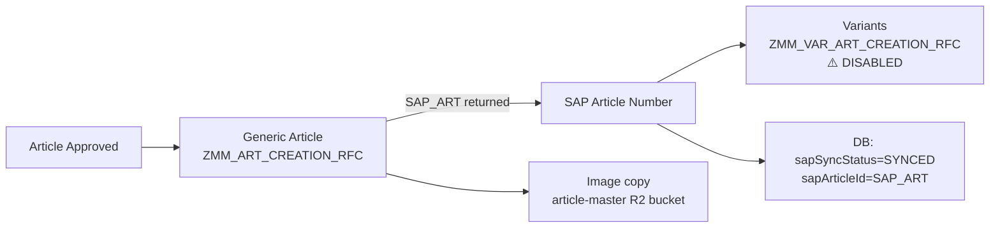

# SAP Sync & RFC Calls

#sap #rfc #sync #article-creation

← [[00 - Index]] | [[02 - Full Workflow]]

---

## Overview

SAP sync happens at approval time. Two RFC services are involved:



---

## RFC 1 — Generic Article Creation

**Service**: `Backend/src/services/zmmArtCreationService.ts`  
**RFC Name**: `ZMM_ART_CREATION_RFC`  
**Endpoint**: `http://routemaster.v2retail.com:9010/api/ZMM_ART_CREATION_RFC`  
**Env override**: `ZMM_RFC_URL`

### Request Body Fields

**Header / Identity**
```
HSN_CODE          hsnTaxCode
SUB_DIV           subDivision
MC_CD             mcCode
VENDOR            vendorCode
DSG_NO            designNumber
MRP               mrp
SEASON            season (e.g. "SS26")
ARTICLE_DES1      articleDescription (max 40 chars)
PRICE_BAND_CAT    segment (BUDGET / PREMIUM etc.)
```

**Fabric (M_* fields)**
```
M_MAIN_MVGR       mainMvgr        ← impAtrbt2 maps here
M_MACRO_MVGR      macroMvgr
M_FAB             weave
M_FAB2            mFab2
M_YARN            yarn1
M_COMPOSITION     composition
M_FINISH          finish
M_CONSTRUCTION    fConstruction
M_SHADE           shade
M_LYCRA           lycra
M_GSM             gsm
M_COUNT           fCount
M_OUNZ            fOunce
M_WIDTH           fWidth
```

**Body (M_* fields)**
```
M_COLLAR          collar
M_NECK_BAND       neck
M_PLACKET         placket
M_BLT_MAIN_STYLE  fatherBelt
M_SLEEVES_MAIN    sleeve
M_SLEEVE_FOLD     sleeveFold
M_BTM_FOLD        bottomFold
M_FO_BTN_STYLE    frontOpenStyle
NO_OF_POCKET      noOfPocket
M_POCKET          pocketType
M_FIT             fit
M_PATTERN         pattern (body_style)
M_LENGTH          length
```

**Accessories & Processing**
```
M_DC_SUB_STYLE    drawcord
M_BTN_MAIN_MVGR   button
M_ZIP             zipper
M_PATCHES         patches
M_PRINT_TYPE      printType
M_EMBROIDERY      embroidery
M_WASH            wash
M_AGE_GROUP       ageGroup
MVGR_BRAND_VENDOR mvgrBrandVendor
G_WEIGHT          weight
```

### Response
```json
{
  "SAP_ART": "1234567890",   // 10-digit SAP article number
  "MSG_TYP": "S",            // S=success, E=error
  "MESSAGE": "Article created successfully"
}
```

**On success**: `sapArticleId = SAP_ART`, `sapSyncStatus = SYNCED`  
**On failure**: `sapSyncStatus = FAILED`, `sapSyncMessage = MESSAGE`

---

## RFC 2 — Variant Article Creation

**Service**: `Backend/src/services/zmmVarArtCreationService.ts`  
**RFC Name**: `ZMM_VAR_ART_CREATION_RFC`  
**Endpoint**: `http://192.168.151.36:9005/api/ZMM_VAR_ART_CREATION_RFC`  
**Env override**: `ZMM_VAR_RFC_URL`

> [!warning] CURRENTLY DISABLED
> The call is commented out in `ApproverController.ts:1558`.  
> The service is fully implemented and ready.  
> Waiting on SAP RFC readiness from the SAP team.

### Per-Variant Request
```
GENERIC_ARTICLE   SAP_ART from generic creation
VAR1CHAR1         V2_SIZE
VAR1VAL1          size value (e.g. "M", "XL")
VAR1CHAR2         V2_COLOR
VAR1VAL2          color value
NET_PRICE         rate
MRP_TYPE          mrp
TAX_CODE          hsnTaxCode
FROM_DATE         DDMMYYYY format
TO_DATE           31129999 (permanent)
SITE              DH24
PUR_GRP           124
SALES_ORG         1100
```

---

## Legacy SAP Sync

**Service**: `Backend/src/services/sapSyncService.ts`  
Older mapping-based approach using `Backend/data/map.json`.  
Retry logic: on "unknown element" SAP error, resend vendor-only body.  
Still referenced but primary flow uses ZMM services.

---

## Mandatory Fields for SAP Sync

If any of these are missing, the item is skipped (not failed) with a warning:

```
vendorCode     — must not be empty
mcCode         — must be derivable from majorCategory
designNumber   — must not be empty
macroMvgr      — must be set
mainMvgr       — must be set (this is impAtrbt2)
mrp            — must be > 0
impAtrbt2      — always mandatory, maps to M_MAIN_MVGR in SAP
```

---

## Image Copy on Approval

After successful RFC sync:
1. Source image URL fetched from `ExtractionResultFlat.imageUrl`
2. Downloaded from R2 source bucket
3. Re-uploaded to `article-master` R2 bucket with key: `{sapArticleNumber}.jpg`
4. If source URL missing → `sapSyncMessage` updated with note, sync still marked SYNCED

---

## SAP Sync Status Values

| Status | Meaning |
|--------|---------|
| `NOT_SYNCED` | Article pending approval or not yet sent to SAP |
| `PENDING` | Sync in progress |
| `SYNCED` | Successfully created in SAP |
| `FAILED` | RFC returned error — check `sapSyncMessage` |
