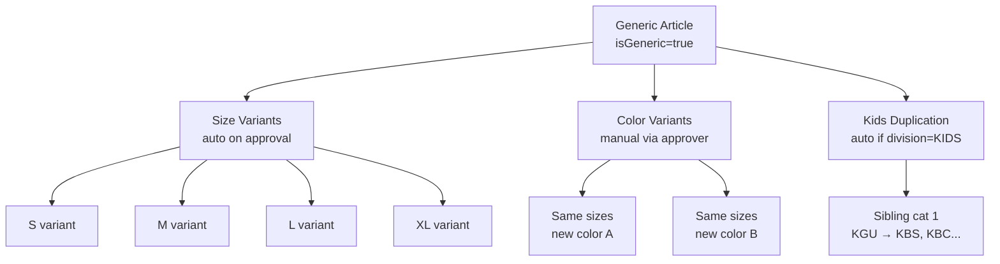
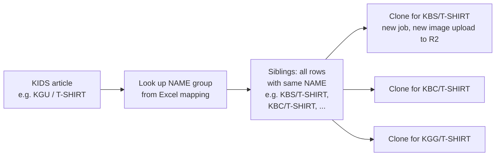

# Variant & Kids Duplication Logic

#variants #kids #duplication #sizes

← [[00 - Index]] | [[02 - Full Workflow]]

---

## Three Types of Multiplication



---

## 1. Size Variants

**Service**: `Backend/src/services/variantCreationService.ts`  
**Triggered**: After generic article approval (called from `approveItems`)  
**Source file**: `Backend/data/variant-sizes-mapping.xlsx`

### How it works
1. Look up major category in the Excel mapping → get list of sizes
   - e.g. "COTTON SHIRTS" → ["XS", "S", "M", "L", "XL", "XXL", "XXXL"]
2. For each size: clone the generic `ExtractionResultFlat` row with:
   - `isGeneric = false`
   - `genericArticleId = parent.id`
   - `variantSize = size`
   - `approvalStatus = PENDING` (variant starts as pending again)
   - `sapSyncStatus = NOT_SYNCED`
3. Variants inherit ALL fabric, body, VA fields from the generic

### Skipped for SRM records
If `pptNumber` is set (SRM source), variants are NOT auto-created.

---

## 2. Color Variants

**Endpoint**: `POST /api/approver/items/:id/add-color`  
**Frontend**: "Add Color" button in `VariantSubTable`

### How it works
1. Approver enters new color name
2. Backend fetches all existing size variants for this generic
3. For each size variant → creates new row with:
   - `variantColor = newColor`
   - `colour = newColor`
   - All other fields copied from size variant
4. New color variants start as PENDING

**Sync color** (`POST /api/approver/items/:id/sync-color`):
- Syncs a color value from generic down to all its size variants

---

## 3. Kids Division Auto-Duplication

**Service**: `Backend/src/services/kidsDivisionDuplicationService.ts`  
**Triggered**: When `division = KIDS` after approval  
**Source file**: `Backend/data/kids-division-mapping.xlsx`

### Excel Schema
```
Columns: SUB-DIV | MAJ_CAT | NAME (grouping key)
```

### How it works


Each sibling clone:
- New `ExtractionResultFlat` row
- New `ExtractionJob` record
- Image re-uploaded to R2 with new key
- `approvalStatus = PENDING`
- `subDivision` and `majorCategory` updated to sibling values
- All attribute fields copied

### Skipped for SRM records
If `pptNumber` is set, kids duplication is NOT triggered.

---

## Variant SubTable UI

**File**: `Frontend/src/features/approver/components/VariantSubTable.tsx`

- Expandable section under each generic article card
- Shows size × color grid
- Columns: variantSize, variantColor, approvalStatus, sapSyncStatus, sapArticleId
- Actions:
  - **Add Color** — triggers dialog → `POST /items/:id/add-color`
  - **Edit variant** — inline edit approval status
  - **Export** — variant-level Excel export

---

## Backfill: variantColor

At every backend startup, the `ApproverController.runStartupBackfills()` function runs:

```
Find all non-generic variants where variantColor IS NULL AND colour IS NOT NULL
→ SET variantColor = colour
```

This repairs rows where `colour` was set but `variantColor` was not synced (historical data).

---

## State: isGeneric flag

| isGeneric | What it means |
|-----------|--------------|
| `true` | The "parent" article — represents the garment design |
| `false` | A size/color variant — child of a generic via `genericArticleId` |

Old articles (with 10-digit numeric names) are treated as generic = they can have variants too.
