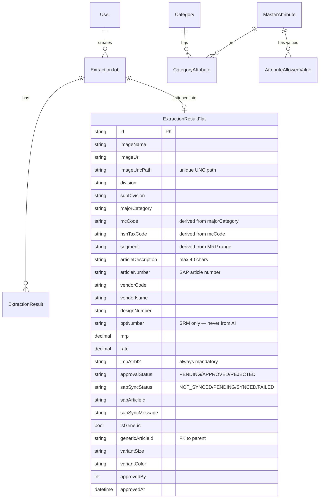

# Data Models — Database Schema

#database #schema #prisma #supabase

← [[00 - Index]]

---

## Two Postgres Schemas



---

## `public` Schema — Core Extraction System

| Model | Purpose |
|-------|---------|
| `Department` | Top level: MENS, LADIES, KIDS |
| `SubDepartment` | e.g. TOPWEAR, BOTTOMWEAR |
| `Category` | e.g. T_SHIRT, JEANS |
| `MasterAttribute` | All possible attributes (COLOR, FABRIC, etc.) |
| `AttributeAllowedValue` | Dropdown options per attribute |
| `CategoryAttribute` | Category ↔ Attribute enabled/required matrix |
| `ExtractionJob` | Each image extraction session |
| `ExtractionResult` | Per-attribute result for a job (normalized) |
| **`ExtractionResultFlat`** | **Main article record — denormalized, one row per article** |
| `MvgrLookup` | MACRO_MVGR / MAIN_MVGR / M_FAB2 reference codes |
| `User` | Auth users |
| `AuditLog` | API call audit trail |
| `ApiKey` | Programmatic access keys |
| `CostSummary` | Aggregated AI cost stats per user |

---

## `360article` Schema — New Article Creation Workflow

| Model | Purpose |
|-------|---------|
| `Article360` | Master record linking to public.extraction_jobs/flat |
| `ArticleFab` | FAB group fields |
| `ArticleBody` | BODY group fields |
| `ArticleVaAcc` | VA ACC group fields |
| `ArticleVaPrcs` | VA PRCS group fields |
| `ArticleBom` | BOM: rate, mrp, impAtrbt2 |
| `SapFieldConfig` | UI field → SAP RFC field mapping (source of truth) |
| `SapAttributeValue` | Dropdown values per SAP field (scoped by majorCategory) |
| **`Article360Flat`** | **Denormalized flat table for fast query/export** |

> The 360article schema is a **mirror** written fire-and-forget after every `ExtractionResultFlat` update.  
> Code: `Backend/src/utils/mirror360Flat.ts`  
> Purpose: powers analytics and alternate query paths without hitting the main flat table.

---

## Key Enums

```typescript
enum UserRole {
  ADMIN, USER, CREATOR, PO_COMMITTEE, APPROVER, CATEGORY_HEAD
}

enum ApprovalStatus {
  PENDING, APPROVED, REJECTED
}

enum SapSyncStatus {
  NOT_SYNCED, PENDING, SYNCED, FAILED
}

enum ExtractionStatus {
  PENDING, PROCESSING, COMPLETED, FAILED
}

enum GarmentType {
  UPPER, LOWER, ALL_IN_ONE
}
```

---

## Critical Field Notes

| Field | Rule |
|-------|------|
| `impAtrbt2` | Always mandatory for approval. Maps to `M_MAIN_MVGR` in SAP. |
| `pptNumber` | Set ONLY by SRM sync. AI extraction must never populate this. |
| `isGeneric` | `true` = parent article; `false` = size/color variant |
| `genericArticleId` | FK to parent `ExtractionResultFlat.id` for variants |
| `imageUncPath` | Unique — dedup key for watcher-ingested images |
| `articleDescription` | Max 40 chars. Auto-built from ordered attribute fields. |
| `mcCode` | Derived from `majorCategory` via `getMcCodeByMajorCategory()` |
| `hsnTaxCode` | Derived from `mcCode` via `getHsnCodeByMcCode()` |
| `segment` | Derived from `(majorCategory, mrp)` via `getSegmentByCategoryAndMrp()` |
| `sapArticleId` | SAP article number returned by ZMM_ART_CREATION_RFC |

---

## Static Data Files (Backend)

| File | Purpose |
|------|---------|
| `Backend/data/MANDATORY GRID DATA.xlsx` | Source of truth for mandatory fields per major category |
| `Backend/src/data/Book10.json` | MVGR lookup data |
| `Backend/src/data/Book11.json` | MVGR lookup data |
| `Backend/src/data/FAB2.json` | FAB2 attribute values |
| `Backend/data/segment-ranges.json` | MRP ranges per major category/segment |
| `Backend/data/hsncode.json` | HSN tax codes by MC code |

## Static Data Files (Frontend)

| File | Purpose |
|------|---------|
| `Frontend/src/data/maj-cat-mandatory.json` | Mandatory attribute keys per major category |
| `Frontend/src/data/majCatAttributeMap.ts` | Allowed values per attribute per major category |
| `Frontend/src/data/majorCategoryMcCodeMap.ts` | Major category → MC code lookup |
| `Frontend/src/data/majorCategoryMap.ts` | Full major category master list with shortForm/fullForm |
