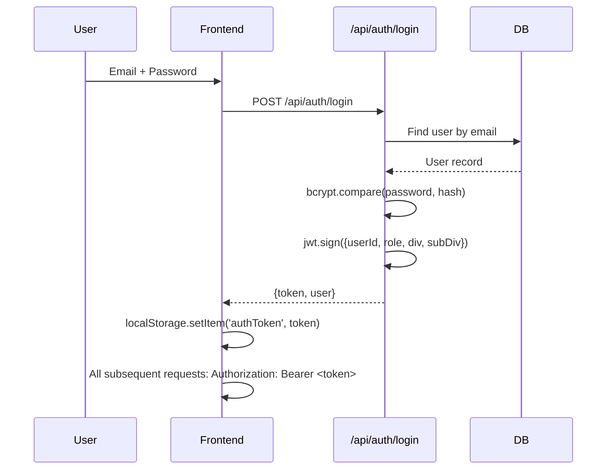
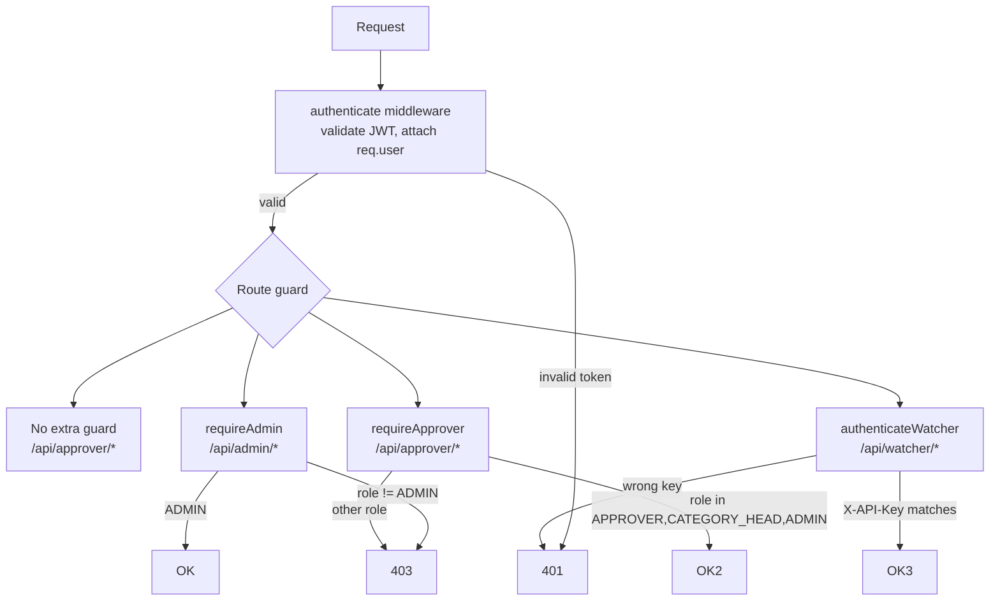

# Auth & Roles

#auth #jwt #rbac #roles

← [[00 - Index]]

---

## Authentication Flow



**Token payload**:
```json
{
  "userId": 42,
  "role": "APPROVER",
  "division": "MENS",
  "subDivision": "TOPWEAR",
  "iat": 1746172800,
  "exp": 1746259200
}
```

---

## Roles

| Role | Description | Can do |
|------|-------------|--------|
| `ADMIN` | Full access | Everything — all divisions, admin panel, user management |
| `CREATOR` | Content creator | Upload images, view extraction results |
| `USER` | Basic user | Same as CREATOR |
| `PO_COMMITTEE` | Purchase Order team | View + export (read-heavy) |
| `APPROVER` | Approver (scoped) | Approver dashboard — own division + subDivision only |
| `CATEGORY_HEAD` | Category head | Approver dashboard — own division (all sub-divisions) |

---

## Route Guards



**Middleware file**: `Backend/src/middleware/auth.ts`

| Middleware | Allowed roles |
|-----------|--------------|
| `authenticate` | Any valid JWT |
| `requireAdmin` | ADMIN only |
| `requireApprover` | APPROVER, CATEGORY_HEAD, ADMIN |
| `requireUser` | CREATOR, PO_COMMITTEE, APPROVER, CATEGORY_HEAD, ADMIN |
| `requireOwnership` | ADMIN bypass, OR `user.id === resource.userId` |
| `authenticateWatcher` | API key: `WATCHER_API_KEY` env var |
| `optionalAuth` | Doesn't fail if no token |

---

## Division / SubDivision Scoping

For `APPROVER` and `CATEGORY_HEAD`, the backend automatically filters data:

```typescript
// In ApproverController.getItems()
if (user.role === 'APPROVER') {
  where.division = user.division;
  where.subDivision = user.subDivision;
} else if (user.role === 'CATEGORY_HEAD') {
  where.division = user.division;
  // subDivision = all
}
// ADMIN: no filter applied
```

This is enforced **server-side** — the UI cannot bypass it.

---

## Frontend Route Guards

**File**: `Frontend/src/app/AppModern.tsx` (or `App.tsx`)

```
/login, /register          → Public (no auth needed)
/dashboard, /products      → ProtectedRoute (any authenticated user)
/extraction/*              → CreatorRoute (blocks APPROVER/CATEGORY_HEAD)
/approver/*                → ApproverRoute (APPROVER, CATEGORY_HEAD, ADMIN)
/admin/*                   → AdminRoute (ADMIN only)
/po-presentation           → ProtectedRoute
```

---

## Session & Caching

- **Single-session enforcement** (optional): `tokenIssuedAt` vs `user.lastLogin` comparison
- **User cache**: 60s TTL in-memory cache on the backend (avoids DB hit on every request)
- **Token expiry**: configurable via `JWT_EXPIRY` env var

---

## Creating Users (Admin only)

`POST /api/admin/users`
```json
{
  "email": "user@v2kart.com",
  "password": "hashed by backend",
  "name": "Display Name",
  "role": "APPROVER",
  "division": "MENS",
  "subDivision": "TOPWEAR"
}
```

Passwords are bcrypt-hashed server-side before storing.
