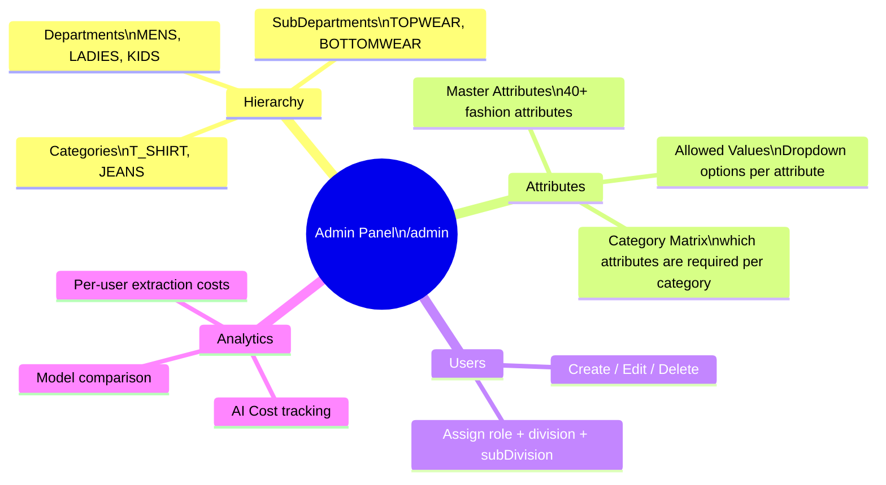

# Admin Panel

#admin #hierarchy #attributes #users

← [[00 - Index]]

---

## What the Admin Panel Manages



---

## Hierarchy Management

**Endpoint prefix**: `/api/admin/`

```
GET/POST/PUT/DELETE  /departments
GET/POST/PUT/DELETE  /sub-departments  (filter: ?departmentId=)
GET/POST/PUT/DELETE  /categories       (filter: ?subDepartmentId=)
```

**3-level hierarchy**:
```
Department (MENS)
  └── SubDepartment (TOPWEAR)
        └── Category (T_SHIRT)
              └── CategoryAttribute (which attributes are required)
```

---

## Master Attributes

Each attribute has:
```
key                  — e.g. "neck", "weave", "gsm"
label                — Display label e.g. "Neck Type"
type                 — TEXT | SELECT | NUMBER
description          — Human description
displayOrder         — Sort order in UI
isActive             — Show/hide in extraction
confidenceThreshold  — Min AI confidence to accept value (0.0-1.0)
rangeConfig          — For NUMBER type: {min, max}
validationRules      — Custom validation JSON
```

---

## Attribute Allowed Values

Per attribute, a list of valid dropdown values:
```
shortForm     — e.g. "rn"
fullForm      — e.g. "round neck"
aliases       — ["ROUND", "ROUNDED"]
displayOrder  — Sort order
```

When AI extraction runs, it matches its output against these values (tokenization + alias matching).

---

## Users Management

**Endpoint**: `/api/admin/users`

| Action | Endpoint |
|--------|---------|
| List all users | GET /api/admin/users |
| Create user | POST /api/admin/users |
| Update user | PUT /api/admin/users/:id |
| Delete user | DELETE /api/admin/users/:id |

Fields managed:
- email, password (bcrypt), name, role
- division, subDivision (scoping for APPROVER/CATEGORY_HEAD)

---

## Analytics / Expenses

**Route**: `/admin/expenses`  
**Data**: `CostSummary` table

Tracks per extraction:
- `tokensUsed` — tokens consumed
- `costUsd` — estimated cost
- `modelUsed` — which AI model
- `processingTimeMs` — latency

Views:
- Cost overview (total, per day)
- Model comparison (Claude vs GPT-4o)
- Per-category cost breakdown
- Per-user breakdown

---

## Mandatory Grid Sync Script

**Script**: `Backend/scripts/sync-mandatory-grid.ts`

Reads `Backend/data/MANDATORY GRID DATA.xlsx` and:
1. Writes `Frontend/src/data/maj-cat-mandatory.json` (JSON array per major category)
2. Updates `CategoryAttribute.isRequired` in DB for every category/attribute pair

Run:
```bash
cd Backend
ts-node scripts/sync-mandatory-grid.ts
# Flags:
#   --json-only   Only write JSON, skip DB
#   --db-only     Only update DB, skip JSON
#   --dry-run     Print changes without writing
```
