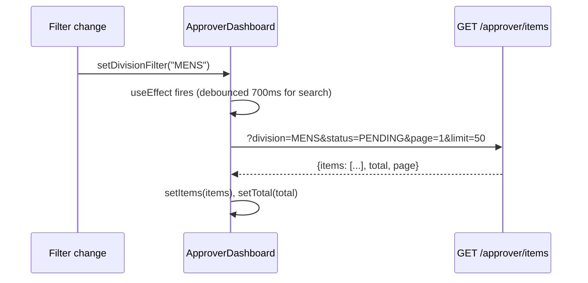

# Frontend Architecture

#frontend #react #components #pages

← [[00 - Index]]

---

## Page / Route Map

```mermaid
flowchart LR
    subgraph PUBLIC["Public"]
        LOGIN[/login]
        REG[/register]
    end

    subgraph CREATOR["Creator (non-approver)"]
        DASH[/dashboard]
        PROD[/products]
        EXT[/extraction/simplified]
        PROF[/profile]
    end

    subgraph APPROVER_ROUTES["Approver"]
        APPR[/approver → New Articles]
        APPR_OLD[/approver/old-articles]
        APPR_REJ[/approver/rejected]
        PO[/po-presentation]
    end

    subgraph ADMIN_ROUTES["Admin only"]
        ADM[/admin/dashboard]
        HIER[/admin/hierarchy]
        USERS[/admin/users]
        EXP[/admin/expenses]
    end
```

---

## Feature Modules (`Frontend/src/features/`)

| Feature | Path | Key components |
|---------|------|---------------|
| `approver` | `features/approver/` | ApproverDashboard, ApproverArticleList, ApproverTable, VariantSubTable |
| `extraction` | `features/extraction/` | SimplifiedExtractionPage, AttributeTable, AttributeCell |
| `admin` | `features/admin/` | AttributeManager, CategoryManager, UsersManagement, HierarchyManagement |
| `analytics` | `features/analytics/` | CostOverview, ModelComparison, CategoryCostTable |
| `dashboard` | `features/dashboard/` | Dashboard, Products, UploadsList, UploadDetail |
| `auth` | `features/auth/` | Login, Register |
| `po-presentation` | `features/po-presentation/` | POPresentationPage |

---

## Key Component Hierarchy (Approver Flow)

```
ApproverDashboard.tsx
├── Filter bar (status, division, subDivision, majorCategory, dateRange, search)
├── Export button
├── ApproverArticleList.tsx  ← Card grid view
│   ├── Article card × N
│   │   ├── Image thumbnail
│   │   ├── Status badge
│   │   ├── PPT number / design number
│   │   ├── 4 collapsible attribute groups (FAB / BODY / VA ACC / VA PRCS)
│   │   │   └── Inline dropdown per field
│   │   ├── impAtrbt2 dropdown (always shown, mandatory)
│   │   ├── Edit button → Modal
│   │   ├── Approve / Reject buttons (PENDING only)
│   │   ├── Create Fabric Article button  ⚠️ 404 — no backend route
│   │   ├── Create Body Article button    ⚠️ 404 — no backend route
│   │   └── Proceed FG Article button     ⚠️ 404 — no backend route
│   └── VariantSubTable.tsx  (expandable)
│       ├── Size × Color grid
│       └── Add Color dialog
└── ApproverTable.tsx  ← Table view (alternative)
```

---

## State Management

- **TanStack Query** — server state (article list, attribute dropdowns, variants)
- **React useState** — local UI state (filters, modal open/close, editing item)
- **Optimistic updates** — applied immediately on field change, synced from server response
- **localValues cache** — temporary map of `{itemId: {field: value}}` for UI consistency
  - Cleared on server response sync to avoid stale values

---

## Data Flow: Article List Load



---

## Key Data Files (`Frontend/src/data/`)

| File | What it drives |
|------|---------------|
| `majCatAttributeMap.ts` | `getMajCatMandatoryKeys(majorCat)` — which fields are required |
| `majCatAttributeMap.ts` | `getMajCatAllowedValues(division, schemaKey)` — dropdown options |
| `majorCategoryMcCodeMap.ts` | `getMcCodeByMajorCategory()` — MC code lookup |
| `maj-cat-mandatory.json` | JSON version of mandatory keys (synced from Excel) |
| `majorCategoryMap.ts` | Full major category list with shortForm / fullForm |

---

## API Service Layer

**File**: `Frontend/src/constants/app/config.ts`  
`APP_CONFIG.api.baseURL` — all fetch calls use this base URL.

```typescript
// Example from ApproverDashboard
const response = await fetch(`${APP_CONFIG.api.baseURL}/approver/items?${params}`);
```

Token from `localStorage.getItem('authToken')` attached as `Authorization: Bearer <token>`.

---

## Attribute Value Caching

**File**: `Frontend/src/services/articleConfigService.ts`

- `preloadAttributeValues(division)` — fetches all dropdown values from `GET /api/article-config`
- `getCachedValues(division, schemaKey)` — returns cached dropdown options
- Used in card inline edit dropdowns and modal select fields
- Cached in module-level map, not re-fetched per card

---

## Export to Excel

**File**: `Frontend/src/shared/utils/export/extractionExport.ts`

- `GET /api/approver/items/export-all` — fetches all records matching current filters (no pagination)
- Maps to 60+ column Excel sheet
- Includes: all attribute fields, business fields, SAP sync status
- File name varies by pathType: "Old Articles", "New Articles", "Rejected Articles"
