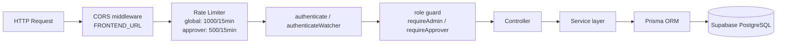
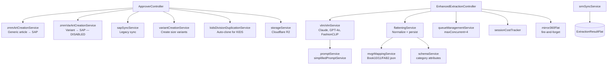

# Backend Architecture

#backend #express #routes #services

← [[00 - Index]]

---

## Request Lifecycle



---

## Route → Controller Map

| Mount path | Route file | Controller |
|-----------|-----------|-----------|
| `/api/auth` | `routes/auth.ts` | `authController` |
| `/api/approver` | `routes/approver.ts` | `ApproverController` |
| `/api/admin` | `routes/admin.ts` | `adminController` |
| `/api/simplified` | `routes/simplifiedExtraction.ts` | `simplifiedExtractionController` |
| `/api/extraction` | `routes/extraction.ts` | `extractionController` / `enhancedExtractionController` |
| `/api/vlm` | `routes/vlmExtraction.ts` | VLM pipeline |
| `/api/article-config` | `routes/articleConfig.ts` | `articleConfigController` |
| `/api/costs` | `routes/costs.ts` | cost tracking |
| `/api/watcher` | `routes/watcher.ts` | watcher + SRM sync |
| `/api/user-extraction` | `routes/userExtraction.ts` | user-scoped extractions |
| `/api/user-feedback` | `routes/userFeedback.ts` | feedback (⚠️ not persisted to DB) |

---

## Services Map



---

## ApproverController — All Endpoints

| Method | Path | Handler | Description |
|--------|------|---------|-------------|
| GET | `/attributes` | `getAttributes` | All dropdown values (cached 5min) |
| GET | `/items` | `getItems` | Paginated list (50/page) with filters |
| GET | `/items/export-all` | `exportAll` | All matching records, no pagination |
| PUT | `/items/:id` | `updateItem` | Edit article fields |
| POST | `/approve` | `approveItems` | Batch approve → SAP sync |
| POST | `/reject` | `rejectItems` | Batch reject |
| GET | `/image/:id` | `getImageUrl` | Refresh expired signed URL |
| GET | `/items/:id/variants` | `getVariants` | Size/color variants for generic |
| POST | `/items/:id/add-color` | `addColor` | Add color variant |
| POST | `/items/:id/sync-color` | `syncColorToVariants` | Push color to all variants |
| GET | `/bom-art-numbers/:majCat` | `getBomArtNumbers` | BOM article # lookup |
| POST | `/backfill-descriptions` | `backfillDescriptions` | Admin: fix article descriptions |

---

## Startup Backfills

Every backend startup runs `ApproverController.runStartupBackfills()`:

| Backfill | What it fixes |
|----------|--------------|
| `backfillMissingMcCodes` | Articles with `majorCategory` but no `mcCode` |
| `backfillMissingHsnCodes` | Articles with `mcCode` but no `hsnTaxCode` |
| `backfillMissingSegments` | Articles with `majorCategory + mrp` but no `segment` |
| `backfillMissingYears` | Articles with no `year` set |
| `backfillMissingSeasonCodes` | Articles with no `seasonCode` |
| `backfillVariantColors` | Variants where `variantColor = null` but `colour != null` |
| `refreshArticleDescriptions` | Recompute `articleDescription` from source fields (last 30 days) |

Can be disabled via `STARTUP_BACKFILLS_ENABLED=false`.

---

## Caching in ApproverController

```typescript
static itemsCache = new Map();   // TTL: 8 seconds
static countCache = new Map();   // TTL: 60 seconds
// Invalidated on every updateItem call
```

Attribute values: 5-minute cache (`getAttributes`)

---

## Key Utility Functions

| Util | File | Input → Output |
|------|------|---------------|
| `buildArticleDescription` | `utils/articleDescriptionBuilder.ts` | fields → 40-char string |
| `getMcCodeByMajorCategory` | `utils/mcCodeMapper.ts` | majorCategory → mcCode |
| `getHsnCodeByMcCode` | `utils/hsnMapper.ts` | mcCode → hsnTaxCode |
| `getSegmentByCategoryAndMrp` | `utils/segmentRangeMapper.ts` | (majorCategory, mrp) → segment |
| `mirror360FlatUpdate` | `utils/mirror360Flat.ts` | flat row → 360article upsert |

---

## Dev Start Commands

```bash
# Backend (port 5001)
cd Backend && npm run dev

# Frontend (port 5174)
cd Frontend && npm run dev

# Watcher service
cd watcher && node index.js
```
